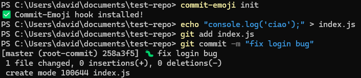

<p align="center">
  
</p>

<p align="center">
  <!-- NPM Version -->
  
  
  <!-- Last Commit -->
  
  
  <!-- Language -->
  

  <!-- Repo Size -->
  

  <!-- Stars -->
  

  <!-- Downloads -->
  

  <!-- License -->
  
</p>

<p align="center"><i>Built with:</i></p>

<p align="center">
  
  
  
  
  
</p>

# Commit-Emojifier 🚀🐛📚

**Automatically add emojis to your Git commit messages based on the type of change!**

---

## 🚩 Why Commit-Emojifier?

- Makes your Git history more readable with clear, intuitive emojis
- Helps you quickly identify if a commit is a feature, bugfix, docs update, etc.
- Easy to install and configure
- Compatible with Windows, macOS, and Linux
- Perfect for teams, open source projects, and personal repos

---

## 🎯 Key Features

- Git `prepare-commit-msg` hook that modifies commit messages automatically
- Customizable emoji mapping via a `.commitemojifier.json` config file
- Simple setup with a single command: `commit-emojifier init`
- Supports common commit types: `feat`, `fix`, `docs`, `refactor`, `test`, `chore`, `style`
- Works with any Git client or editor

---

## 🚀 Installation

### Prerequisites

- [Node.js](https://nodejs.org/) (v14 or higher)
- Git

### Steps

```bash
npm install -g commit-emojifier
cd commit-emojifier
git init      # if you don't have a repo yet
commit-emojifier init
```
- This installs the Git hook required for emoji injection.

## 🛠️ Usage

From now on, whenever you commit with a message starting with a supported keyword, the corresponding emoji will be prepended automatically.

### Examples:

```bash
git commit -m "feat: add login system"
# Becomes: ✨ feat: add login system

git commit -m "fix: resolve authentication bug"
# Becomes: 🐛 fix: resolve authentication bug
```



## ⚙️ Customization

Create a `.commitemojifier.json` file in your project root to define custom emoji mappings:

```json
{
  "feat": "✨",
  "fix": "🐛",
  "docs": "📝",
  "refactor": "🔧",
  "test": "✅",
  "chore": "🔨",
  "style": "🎨"
}
```

The tool will prioritize your custom config if present.

## 🧪 Development & Testing

1. Clone the repository
2. Install dependencies: `npm install`
3. Link package locally: `npm link`
4. Test in a sample repo: `commit-emojifier init`

## 📢 Contributing

Contributions are welcome! Feel free to:
- Open issues for bugs or feature requests
- Submit pull requests
- Improve documentation
- Share feedback

## 📜 License

MIT License © 2025 callmenoway

## ❤️ Support

If you find Commit-Emoji useful:
- ⭐ Star the repository
- Share with your friends and colleagues
- Report issues or contribute improvements